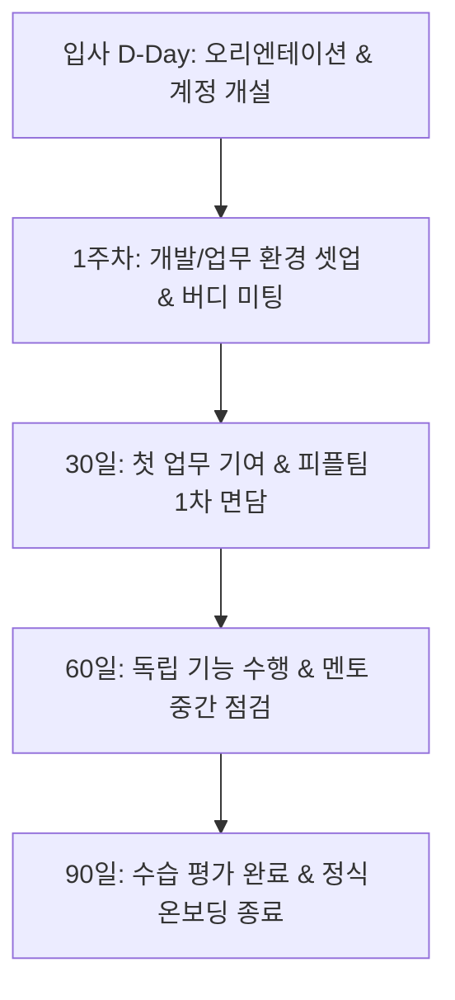

# 넥사테크(NexaTech) 신규 입사자 온보딩 가이드

> **알림**: 본 문서는 넥사테크(NexaTech) 신규 입사자를 위한 공식 사내 가이드 문서 모음입니다.  
> RAG 시스템을 통해 사내 지식을 검색하고 질의응답할 수 있도록 표준 포맷으로 작성되었습니다.

---

## 1. 사내 규정 및 온보딩 문서 체계

넥사테크의 모든 사내 문서는 직무 및 접근 권한(Role)에 따라 안전하게 관리됩니다.

| 문서 ID | 파일명 | 문서 제목 | 권한 (access_role) | 담당 부서 |
|---|---|---|---|---|
| `GEN-001` | `01_취업규칙_요약.md` | 취업규칙 요약 | `all` (전사) | 경영지원팀 |
| `HR-001` | `02_연차_휴가_규정.md` | 연차 및 휴가 규정 | `all` (전사) | 인사팀 |
| `GEN-002` | `03_재택근무_운영_지침.md` | 재택근무 운영 지침 | `all` (전사) | 인사팀 |
| `FIN-001` | `04_경비_정산_가이드.md` | 경비 정산 가이드 | `all` (전사) | 재무팀 |
| `FIN-002` | `05_법인카드_사용_규정.md` | 법인카드 사용 규정 | `all` (전사) | 재무팀 |
| `HR-002` | `06_복리후생_안내.md` | 복리후생 안내 | `all` (전사) | 인사팀 |
| `HR-003` | `07_신규_입사자_온보딩_체크리스트.md` | 신규 입사자 온보딩 체크리스트 | `all` (전사) | 인사팀 |
| `IT-001` | `08_장비_및_계정_신청_절차.md` | 장비 및 계정 신청 절차 | `all` (전사) | IT인프라팀 |
| `SEC-001` | `09_정보보안_기본_수칙.md` | 정보보안 기본 수칙 | `all` (전사) | 정보보안팀 |
| `GEN-003` | `10_조직도_및_부서별_업무_안내.md` | 조직도 및 부서별 업무 안내 | `all` (전사) | 경영지원팀 |
| `HR-011` | `11_연봉_테이블_및_직급_체계.md` | 연봉 테이블 및 직급 체계 | `hr` (인사팀 전용) | 인사팀 |
| `HR-012` | `12_인사평가_운영_세칙.md` | 인사평가 운영 세칙 | `hr` (인사팀 전용) | 인사팀 |
| `ENG-001` | `13_개발_환경_셋업_가이드.md` | 개발 환경 셋업 가이드 | `eng` (개발팀 전용) | 개발팀 |
| `ENG-002` | `14_코드_리뷰_및_배포_규정.md` | 코드 리뷰 및 배포 규정 | `eng` (개발팀 전용) | 개발팀 |
| `FIN-011` | `15_예산_집행_승인_한도_규정.md` | 예산 집행 승인 한도 규정 | `finance` (재무팀 전용) | 재무팀 |

---

## 2. 온보딩 로드맵 (Roadmap)

---

## 3. 주요 문의 창구

- **인사 / 온보딩 전반**: 피플팀 (`people@nexatech.ai`, Slack `#ask-people`)
- **IT 장비 / 계정 / 소프트웨어**: IT인프라팀 (`it-support@nexatech.ai`, Slack `#it-helpdesk`)
- **보안 관련 문의 / 사고 접수**: 정보보안팀 (`security@nexatech.ai`, Slack `#security-incident`)
- **경비 / 법인카드 / 예산**: 재무팀 (`finance@nexatech.ai`, Slack `#ask-finance`)
